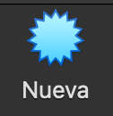
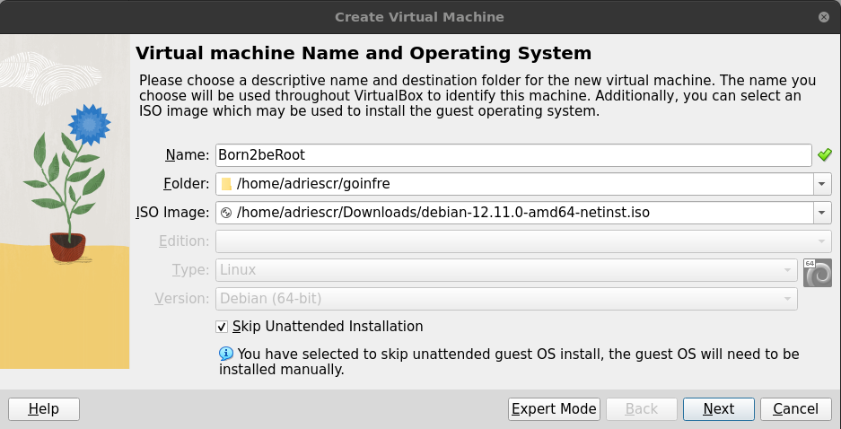

# Introducción

El proyecto **Born2beroot** es una introducción al mundo de la administración de sistemas y la virtualización. 🌐 A través de este ejercicio, aprenderás a configurar y gestionar un servidor virtualizado, implementando buenas prácticas de seguridad y optimización. 🔒 Este proyecto está diseñado para ayudarte a comprender los fundamentos de los sistemas operativos y la administración de servidores, habilidades esenciales para cualquier desarrollador o administrador de sistemas. 🛠️

El objetivo principal es instalar y configurar una máquina virtual con un sistema operativo basado en Linux, siguiendo una serie de requisitos específicos. 🚀 Este proyecto te permitirá explorar conceptos como la gestión de usuarios, permisos, particiones, servicios y configuraciones de red. 🌟

Además, **Born2beroot** es un desafío que fomenta la autonomía y la resolución de problemas, preparándote para proyectos más avanzados en el futuro. 🔑 La clave del éxito radica en documentar cada paso del proceso y garantizar que tu configuración sea robusta y segura. 🧹 ¡Prepárate para sumergirte en el fascinante mundo de la administración de sistemas y llevar tus habilidades al siguiente nivel! 💻✨

## Instrucciones generales

- El uso de VirtualBox es obligatorio (o UTM en caso de que VirtualBox no funcione en tu máquina).
- Solo debes entregar un archivo llamado signature.txt en la raíz de tu repositorio. Debes pegar en él la firma del disco virtual de tu máquina. Ve a Entrega y evaluación para más información.

# Intrucciones para realizar el proyecto
En este apartado encontrarás una guía paso a paso para llevar a cabo el proyecto **Born2beroot**. Se detallarán las acciones necesarias desde la preparación del entorno hasta la configuración de la máquina virtual, asegurando que cumplas con todos los requisitos y buenas prácticas recomendadas. Sigue cada sección cuidadosamente para lograr una instalación y configuración exitosa.

## 1. Descargar la ISO
Antes de comenzar la instalación, es necesario descargar la imagen ISO del sistema operativo que vas a utilizar en tu máquina virtual. Puedes elegir entre **Debian** o **Rocky Linux**, según tus preferencias y los requisitos del proyecto.

- [Descargar Debian](https://www.debian.org/index.es.html#:~:text=operativo%20completamente%20libre!-,Descargar,-Otras%20descargas)
- [Descargar Rocky](https://rockylinux.org/es-ES#:~:text=by%20the%20community.-,Download,-Migrate)

Asegúrate de seleccionar la versión adecuada (generalmente la versión estable más reciente) y la arquitectura compatible con tu hardware (normalmente x86_64 o amd64).

Una vez descargada la ISO, guárdala en una ubicación accesible, ya que la necesitarás para crear la máquina virtual en el siguiente paso.

**En mi caso he seleccionado Debian**

## 2. Creación de la máquina virtual
**"Importante"** Si no tienes VirtualBox, aquí te dejo el link de descarga de la aplicación. [**Descarga 🔎**](https://www.virtualbox.org/wiki/Downloads)

1. **Crear una máquina virtual**
    Para crear una máquina virtual, tenemos que darle a ``New\Nueva``.
    

        
    

2. **Selección de opciones principales**
    Una vez dentro, tenemos que poner nombre a la máquina virtual, despues seleccionamos la ISO del sistema que deseamos hacer la máquina virtual.
    

        
    

3. **Hardware de la máquina virtual**
    En esta ventana vamos a seleccionar el hardware que va a tener la máquina virtual.
    

# Preguntas de corrección

## Que es una Máquina Virtual
Una VM es una aplicación que le permite instalar un sistema operativo adicional en su máquina física, lo que le permite ejecutar ambos sistemas simultáneamente.

## Beneficios de usar Máquinas Virtuales
Principales beneficios de las máquinas virtuales :
- Rentable : los costos de mantenimiento son prácticamente cero ya que la VM comparte componentes físicos con su computadora.
- Seguridad : En caso de riesgo de seguridad, su equipo principal permanece seguro. Por ejemplo, si un virus afecta la máquina virtual, puede desinstalarla en segundos sin consecuencias para el sistema host.

## Selección de ISO
**Debian**: Es una distribución reconocida por su estabilidad, amplia documentación y gran comunidad de soporte. Es ideal para quienes buscan un sistema robusto, seguro y fácil de mantener, siendo especialmente recomendable para entornos de aprendizaje y servidores de propósito general.

**Rocky Linux**: Está orientada al ámbito empresarial y es compatible con RHEL (Red Hat Enterprise Linux). Destaca por sus avanzadas medidas de seguridad, soporte a largo plazo y el uso de gestores de paquetes como `yum` y `dnf`, lo que facilita la administración de software en entornos complejos y profesionales.

La elección entre Debian y Rocky Linux dependerá de tus necesidades: si buscas simplicidad y estabilidad, Debian es una excelente opción; si prefieres un entorno más cercano al estándar empresarial, Rocky Linux es recomendable.

## Diferencias entre **APT** y **Aptitude**
**APT**: Ejecuta únicamente los comandos especificados en la línea de comando, gestionando paquetes de manera sencilla y directa.

**Aptitude**: Es una versión más avanzada de APT que ofrece una interfaz interactiva y distingue entre los paquetes instalados explícitamente y sus dependencias. Además, elimina automáticamente las dependencias que ya no se utilizan, facilitando la gestión y limpieza del sistema.

## ¿Qué es **AppArmor**?
**AppArmor** es un sistema de control de acceso obligatorio (MAC) utilizado por defecto en Debian para reforzar la seguridad del sistema. Permite definir perfiles de seguridad para cada aplicación, limitando estrictamente los recursos y archivos a los que pueden acceder. De este modo, incluso si una aplicación es comprometida, AppArmor reduce el impacto restringiendo sus acciones solo a lo estrictamente necesario para su funcionamiento.

# Herramientas recomendadas

- **VirtualBox/UTM**: Para la virtualización de tu máquina. [**Descarga**](https://www.virtualbox.org/wiki/Downloads)
- **SSH**: Para la gestión remota del servidor.

¡Buena suerte con tu proyecto Born2beroot! 🚀
