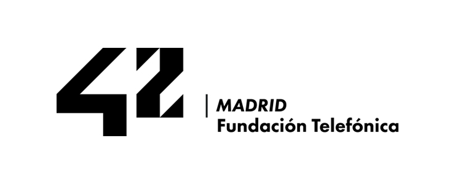

# 42 Network - Proyectos y Aprendizaje 🚀
¡Bienvenido a mi repositorio de proyectos desarrollados durante mi formación en [**42 Network**](#-42-network)! 🎓✨ Este espacio es una recopilación exhaustiva de los desafíos, ejercicios y proyectos que he completado a lo largo de mi trayectoria como programador. Aquí podrás explorar mi progreso técnico 💻, mi capacidad para resolver problemas complejos 🧠 y mi experiencia trabajando en equipo 🤝 en un entorno colaborativo y desafiante.

Cada proyecto en este repositorio incluye documentación detallada que abarca los siguientes aspectos:

- **🎯 Objetivos:** Una descripción clara del propósito y las metas específicas de cada proyecto.
- **🛠️ Herramientas y Tecnologías:** Un listado de las tecnologías, lenguajes de programación y herramientas utilizadas durante el desarrollo.
- **📚 Lecciones Aprendidas:** Reflexiones clave sobre los aprendizajes obtenidos y cómo estos han contribuido a mi crecimiento profesional.
- **🚧 Retos Superados:** Una descripción de los desafíos más significativos enfrentados durante el desarrollo y las estrategias empleadas para superarlos.
- **🌟 Impacto:** Una evaluación de cómo cada proyecto ha influido en mi desarrollo como programador, destacando las habilidades técnicas y blandas adquiridas o mejoradas.

Este repositorio no solo es un reflejo de mi evolución como programador, sino también una fuente de inspiración 💡 para otros que estén interesados en el aprendizaje autodidacta y en el emocionante mundo de la programación. ¡Gracias por tomarte el tiempo de visitarlo! 🌟

---

## 📂 Estructura del Repositorio

El repositorio está organizado de manera lógica para facilitar la navegación y el acceso a los diferentes proyectos. A continuación, se detalla la estructura principal:

- **[`Piscine`](./Piscine/README.md)**: 🌊 Proyectos realizados durante la prueba de acceso conocida como "Piscina". Aquí se incluyen ejercicios básicos de programación, algoritmos y estructuras de datos que sentaron las bases de mi aprendizaje.
- **[`Cursus`](./Cursus/README.md)**: 📘 Proyectos del programa principal de 42 Madrid. Estos proyectos abarcan una amplia gama de temas avanzados en programación, incluyendo:
  - **[`C`](./Cursus/C/README.md):** Proyectos desarrollados en lenguaje C, que incluyen conceptos fundamentales como punteros, memoria dinámica, estructuras de datos y algoritmos.
    - **[`C++`](./Cursus/C++/README.md):** Módulos de C++ centrados en programación orientada a objetos, templates y la STL.
  - **[`Sistemas`](./Cursus/Sistemas/README.md):** Proyectos enfocados en sistemas operativos, redes y servicios, diseñados para desarrollar habilidades en administración de sistemas y programación a bajo nivel.

Cada directorio contiene su propia documentación detallada para facilitar la comprensión y el uso de los proyectos.

---

## 🌟 42 Madrid



[42 Madrid](https://www.42madrid.com/) es una academia de programación innovadora que forma parte de la red global de [academias 42](#-42-network) 🌍, presente en más de 20 países 🌎 y respaldada por instituciones de renombre como [Fundación Telefónica](#fundación-telefónica) 📞. Este modelo educativo disruptivo se basa en un enfoque pedagógico único que elimina las clases tradicionales y los profesores, reemplazándolos por un aprendizaje basado en proyectos 🛠️ y la colaboración entre pares 🤝.

En 42 Madrid, los estudiantes son los protagonistas de su propio aprendizaje 🎓. A través de proyectos prácticos y desafiantes 🚀, desarrollan habilidades técnicas avanzadas en áreas como programación 💻, algoritmos 🔢, redes 🌐, sistemas operativos 🖥️ y desarrollo de software 🛠️. Además, el entorno colaborativo fomenta el intercambio de conocimientos 📚, la resolución conjunta de problemas 🧠 y el desarrollo de habilidades interpersonales esenciales para el trabajo en equipo 🤝.

El modelo educativo de 42 Madrid se centra en la autonomía 🧑‍💻, la creatividad 🎨 y la adaptabilidad 🔄, cualidades esenciales para destacar en el mundo de la tecnología. Los estudiantes no solo adquieren conocimientos técnicos, sino que también aprenden a gestionar su tiempo ⏳, a trabajar bajo presión 💪 y a adaptarse rápidamente a nuevas herramientas y lenguajes de programación 🛠️.

Además, 42 Madrid está abierta las 24 horas del día 🕒, los 7 días de la semana 📅, lo que permite a los estudiantes organizar su tiempo de manera flexible y personalizada. Este enfoque inclusivo y accesible ha permitido que personas de diferentes edades 👩‍🦳👨‍🦱, antecedentes 🌍 y niveles de experiencia encuentren en 42 Madrid una oportunidad para reinventarse y construir una carrera en el sector tecnológico 💼.

La red global de [academias 42](#-42-network) ha sido reconocida internacionalmente 🏆 por su capacidad para formar profesionales altamente capacitados y preparados para los desafíos del mercado laboral 💼. Los graduados de 42 Madrid no solo destacan por sus habilidades técnicas 💻, sino también por su mentalidad resiliente 💪, su capacidad para aprender de manera continua 🔄 y su enfoque innovador para resolver problemas complejos 🧠.

### 🧠 Filosofía de Aprendizaje

El enfoque educativo de 42 Madrid está diseñado para preparar a los estudiantes para los desafíos del mundo real. A través de proyectos prácticos y un entorno colaborativo, los estudiantes desarrollan tanto habilidades técnicas como blandas. Algunos de los pilares fundamentales de esta filosofía son:

- **🛠️ Resolución de Problemas:** Los estudiantes enfrentan desafíos complejos que requieren soluciones innovadoras y efectivas, fortaleciendo su capacidad analítica y lógica.
- **🤝 Trabajo en Equipo:** La colaboración es clave en 42 Madrid. Los estudiantes trabajan juntos en proyectos, aprendiendo a comunicarse, compartir conocimientos y resolver conflictos de manera constructiva.
- **⏳ Gestión del Tiempo:** La planificación y priorización son esenciales para cumplir con los plazos de los proyectos, lo que ayuda a desarrollar una mentalidad organizada y profesional.
- **🌐 Adaptabilidad:** En un campo en constante evolución como la tecnología, los estudiantes aprenden a dominar nuevas herramientas, lenguajes de programación y conceptos rápidamente, preparándose para un entorno laboral dinámico.
- **🔍 Aprendizaje Autodirigido:** Sin profesores que guíen cada paso, los estudiantes son responsables de su propio progreso, lo que fomenta la independencia y la capacidad de aprender de manera continua.

### 🌍 Impacto Global

La red de academias [**42**](#-42-network) ha sido reconocida internacionalmente por su enfoque innovador y su capacidad para formar profesionales altamente capacitados. Los graduados de 42 Madrid no solo adquieren habilidades técnicas avanzadas, sino también una mentalidad resiliente y adaptable que los prepara para liderar en la industria tecnológica.

### 🌐 Sitio Web Oficial

Para obtener más información sobre la academia 42 Madrid y explorar sus iniciativas, visita el sitio web oficial: [**42 Madrid Official Website**](https://www.42madrid.com).

---

## 🌟 Fundación Telefónica


La [**Fundación Telefónica**](https://www.fundaciontelefonica.com) es una institución líder en el ámbito de la innovación, la educación y el desarrollo social, comprometida con la transformación digital y el progreso de la sociedad. A través de iniciativas como [**42 Madrid**](#-42-madrid), la Fundación Telefónica busca fomentar el talento digital, capacitar a las personas para enfrentar los desafíos del futuro y reducir la brecha digital mediante programas inclusivos y accesibles.

#### 🚀 Misión y Visión

La misión de la Fundación Telefónica es contribuir al desarrollo de una sociedad más equitativa y preparada para los retos del siglo XXI, promoviendo la educación tecnológica, la creatividad y la colaboración. Su visión es ser un referente global en la formación de profesionales altamente capacitados, capaces de liderar en un mundo en constante evolución.

#### 🌐 Áreas de Impacto

La Fundación Telefónica trabaja en diversas áreas clave para maximizar su impacto social y educativo:

- **📚 Educación Digital:** Desarrollo de programas educativos innovadores que integran la tecnología como herramienta principal para el aprendizaje continuo y la adquisición de habilidades digitales.
- **🤝 Inclusión Social:** Promoción de iniciativas que garantizan el acceso a la educación tecnológica para personas de todas las edades, géneros y contextos socioeconómicos.
- **💡 Innovación:** Impulso de proyectos que combinan creatividad y tecnología para resolver problemas sociales y fomentar el emprendimiento digital.
- **🌍 Sostenibilidad:** Compromiso con el desarrollo sostenible mediante la implementación de programas que promueven el uso responsable de la tecnología y la reducción de la brecha digital.

#### 🛠️ Iniciativas Destacadas

Entre las iniciativas más destacadas de la Fundación Telefónica se encuentra [**42 Madrid**](#-42-madrid), una academia de programación disruptiva que forma parte de la red global de academias [42 Network](#-42-network). Este modelo educativo innovador elimina las clases tradicionales y los profesores, ofreciendo un entorno de aprendizaje basado en proyectos y colaboración entre pares. Además, la Fundación Telefónica lidera otros programas como:

- **Conecta Empleo:** Formación en competencias digitales para mejorar la empleabilidad.
- **Voluntarios Telefónica:** Iniciativas solidarias que involucran a empleados de Telefónica en proyectos sociales y educativos.
- **Think Big:** Apoyo a jóvenes emprendedores con ideas innovadoras que buscan generar un impacto positivo en la sociedad.

#### 🌟 Compromiso con el Futuro

La Fundación Telefónica no solo se enfoca en el presente, sino que también trabaja para anticiparse a las necesidades del futuro. A través de la investigación, la colaboración con instituciones educativas y la implementación de tecnologías emergentes, busca preparar a las nuevas generaciones para un mundo laboral dinámico y en constante cambio.

Con su enfoque en la inclusión, la accesibilidad y la innovación, la Fundación Telefónica se posiciona como un pilar fundamental en la construcción de una sociedad más justa, equitativa y tecnológicamente avanzada. Su labor es un ejemplo de cómo la tecnología puede ser una herramienta poderosa para transformar vidas y construir un futuro mejor para todos.

### 🌐 Sitio Web Oficial

Para obtener más información sobre la Fundación Telefónica y explorar sus iniciativas, visita el sitio web oficial: [**Fundación Telefónica Website**](https://www.fundaciontelefonica.com).

---

## 🌐 42 Network


La [**42 Network**](https://www.42network.org) es una red global de academias de programación innovadoras 🌍, presente en más de 20 países y con más de 40 campus en todo el mundo. Este modelo educativo disruptivo, sin clases tradicionales ni profesores, se basa en el aprendizaje autodirigido, la colaboración entre pares y la resolución de problemas a través de proyectos prácticos.

### 🚀 Misión y Visión

La misión de la 42 Network es democratizar el acceso a la educación tecnológica y formar a la próxima generación de profesionales altamente capacitados en el ámbito de la programación y la tecnología. Su visión es ser un referente global en la formación de talento digital, promoviendo la inclusión, la creatividad y la innovación.

### 🌟 Características Clave

- **📚 Aprendizaje Basado en Proyectos:** Los estudiantes desarrollan habilidades técnicas y blandas al trabajar en proyectos prácticos que simulan desafíos del mundo real.
- **🤝 Colaboración entre Pares:** El modelo educativo fomenta el trabajo en equipo, el intercambio de conocimientos y la resolución conjunta de problemas.
- **🔍 Autonomía:** Los estudiantes son responsables de su propio aprendizaje, lo que fortalece su capacidad para adaptarse y aprender de manera continua.
- **🌐 Red Global:** La 42 Network conecta a estudiantes de todo el mundo, creando una comunidad internacional de programadores y profesionales tecnológicos.

### 🌍 Impacto Global

Desde su creación, la 42 Network ha formado a miles de estudiantes que ahora trabajan en empresas líderes en tecnología, startups innovadoras y proyectos de impacto social. Su enfoque inclusivo y accesible ha permitido que personas de diferentes edades, géneros y contextos socioeconómicos encuentren una oportunidad para desarrollar sus habilidades y construir una carrera en el sector tecnológico.


### 🛠️ Proyectos y Colaboraciones

La 42 Network colabora con empresas, instituciones educativas y organizaciones sin fines de lucro para desarrollar programas que aborden los desafíos actuales de la industria tecnológica. Además, fomenta la innovación y el emprendimiento a través de hackatones, talleres y eventos internacionales.

Con su enfoque único y su compromiso con la excelencia, la 42 Network continúa transformando vidas y redefiniendo la educación tecnológica en todo el mundo.

### 🌐 Sitio Web Oficial

Para obtener más información sobre la red global de academias 42 y explorar sus iniciativas, visita el sitio web oficial: [**42 Network Official Website**](https://www.42network.org).

---

## 🚀 Cómo Clonar y Explorar este Repositorio

Si deseas explorar este repositorio y experimentar con los proyectos incluidos, sigue estos pasos para obtener una copia local y comenzar a trabajar con ella:

1. **📥 Clonar el repositorio:**
    Abre tu terminal y ejecuta el siguiente comando para clonar el repositorio:
    ```bash
    git clone https://github.com/adrian-9559/42_Madrid.git
    ```

2. **📂 Acceder al directorio clonado:**
    Una vez clonado, navega al directorio del repositorio con el siguiente comando:
    ```bash
    cd 42_Madrid
    ```

3. **🔍 Explorar y aprender:**
    Examina los diferentes proyectos, consulta la documentación detallada y experimenta con el código fuente. Cada proyecto está diseñado para ofrecer una experiencia de aprendizaje única. ¡Disfruta el proceso! 💻✨

4. **▶️ Ejecutar proyectos:**
    Algunos proyectos incluyen instrucciones específicas para ejecutarlos. Asegúrate de revisar los archivos `README.md` dentro de cada directorio para obtener detalles sobre cómo configurarlos y ejecutarlos correctamente.

---

## 📬 Contacto

¡Gracias por explorar mi trabajo y por interesarte en mi trayectoria como programador! 😊 Si tienes preguntas, comentarios o sugerencias, no dudes en ponerte en contacto conmigo. Estoy disponible a través de los siguientes canales:

- **🌐 Sitio Web Oficial:** [Porfolio](https://porfolio-adrianescribano3-gmailcoms-projects.vercel.app/)
- **📬 Correo Electrónico:** [adrian.escribano3@gmail.com](mailto:adrian.escribano3@gmail.com?subject=Consulta%20sobre%20repositorio%2042%20Madrid)
- **🔗 LinkedIn:** [Adrián en LinkedIn](https://www.linkedin.com/in/adrián-escribano-pérez)
- **🐙 GitHub:** [adrian-9559](https://github.com/adrian-9559)
- **Usuario en 42:** [adriescr](https://profile.intra.42.fr/users/adriescr)

Espero que disfrutes explorando este repositorio tanto como yo disfruté creándolo. Si encuentras algo interesante o tienes alguna sugerencia, no dudes en compartirla. ¡Buena suerte en tu propio viaje de aprendizaje y desarrollo profesional! 🚀🌟
